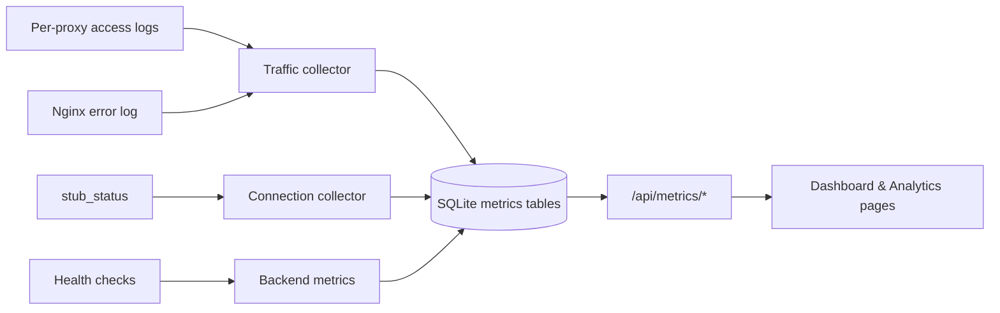

# Observability & Monitoring

This platform collects metrics from NGINX access logs, error logs, stub_status, health checks, and security events. Data is stored in SQLite with configurable retention and exposed through `/api/metrics/*` and the Observability UI.

## Data flow



## Dashboard

- **Legacy:** `GET /api/dashboard` — backward-compatible stats used by the home page.
- **Metrics:** `GET /api/metrics/dashboard` — extended KPIs (live traffic, SSL summary, merged alerts).

Both endpoints derive from the same metrics services so counts stay consistent.

## Enabling stub_status

The admin API listens on `127.0.0.1:8080`. Use a **different port** for stub_status (default collector URL: `http://127.0.0.1:8081/nginx_status`).

Example NGINX snippet (localhost only):

```nginx
server {
    listen 127.0.0.1:8081;
    server_name localhost;

    location /nginx_status {
        stub_status;
        allow 127.0.0.1;
        deny all;
    }
}
```

Reload NGINX, then set the URL under **Settings → Metrics** or `GET/PUT /api/metrics/settings`.

## Enhanced JSON access logging

1. Ensure `deploy/nginx/proxy-analytics-log.conf` is installed to `/etc/nginx/conf.d/` (done by `deploy/full-sync.sh`).
2. Enable **Enhanced JSON analytics logging** on a proxy app in the Admin UI, or set the default in Metrics settings.
3. Re-save the proxy so NGINX uses `log_format proxy_json` for that host's access log.

The JSON format includes upstream address and timing fields used for status-code breakdowns and failed-request hints. It intentionally excludes cookies, Authorization headers, and request bodies.

## Retention

Configure under **Settings → Metrics**:

| Setting | Default | Purpose |
|---------|---------|---------|
| Raw events | 7 days | Sampled `RequestEvent` rows (live/failed views) |
| Minute aggregates | 30 days | High-resolution traffic metrics |
| Hour aggregates | 180 days | Long-term trends |

A daily scheduler job purges data older than these thresholds.

## Troubleshooting playbooks

| Symptom | Where to look | Typical fix |
|---------|---------------|-------------|
| Many **502** | Analytics → Status codes, Failed requests | Check backend connectivity and upstream definitions |
| Many **504** | Failed requests, Backend analytics | Increase upstream timeouts; fix slow backends |
| High **error rate** | Dashboard live traffic, Alerts | Review recent nginx error log lines |
| Abusive client IPs | Analytics → Client IPs | Block via Security → IP rules |
| Cert expiring | Analytics → SSL, Certificates | Renew or import certificate |
| No connection metrics | Settings → Metrics stub_status URL | Enable localhost stub_status endpoint |
| Empty live requests | Proxy enhanced logging | Enable JSON logging and generate traffic |

## Metric alert rules

Manage rules under **Alerts** (`/api/alerts`). Supported metric types include error rate, 5xx count, response time, active connections, bandwidth, and backend offline count.

Rules are evaluated on the scheduler cycle. Email notifications reuse the SMTP notification pipeline with a 15-minute dedupe window per rule.

## Privacy

`RequestEvent` stores an allowlist of fields only: timestamp, proxy id, client IP, host, method, URI, status, backend address, response times, bytes sent, and user agent. Never log Authorization, Cookie, or request/response bodies.

## API reference

| Endpoint | Description |
|----------|-------------|
| `GET /api/metrics/dashboard` | System, proxy, traffic, SSL, alerts |
| `GET /api/metrics/traffic?range=` | Time series KPIs |
| `GET /api/metrics/status-codes?range=` | Status breakdown + hints |
| `GET /api/metrics/proxy-hosts?range=` | Per-host table |
| `GET /api/metrics/client-ips?range=` | Top clients |
| `GET /api/metrics/backends?range=` | Backend health + history |
| `GET /api/metrics/connections?range=` | stub_status series |
| `GET /api/metrics/ssl` | Certificate inventory |
| `GET /api/metrics/security?range=` | Security event aggregates |
| `GET /api/live-requests` | Paginated request events |
| `GET /api/failed-requests` | Failed/error requests |
| `GET/POST/PUT/DELETE /api/alerts` | Metric alert rules |
| `GET/PUT /api/metrics/settings` | Retention and collector config |

All routes require `READ` permission; mutations require `EDIT` (admin).
